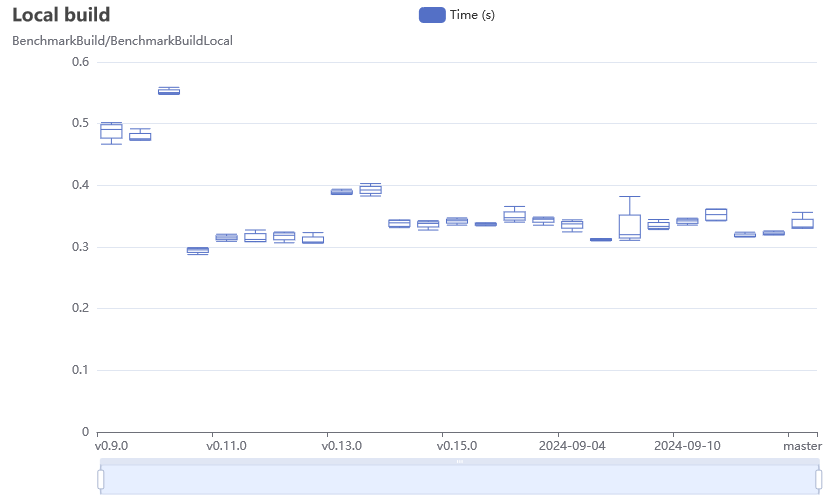

# BuildKit Benchmarks

[](https://github.com/moby/buildkit-bench/actions?query=workflow%3Aci)

This repository contains a set of benchmarks for [BuildKit](https://github.com/moby/buildkit)
that run on GitHub Actions [public runners](https://github.com/actions/runner-images).
Results are published on [GitHub Pages](https://moby.github.io/buildkit-bench/).



___

* [Usage](#usage)
* [License](#license)

## Usage

To run locally, you can use the following command:

```bash
make test
```

This runs all tests and benchmarks from [./test](./test) package with BuildKit
changes from default branch. You can also specify a commit to test or multiple
references and tweak the benchmark settings:

```bash
# run a specific benchmark
TEST_BENCH_REGEXP=/BenchmarkBuildLocal$ make test

# run all benchmarks 3 times (default 1)
TEST_BENCH_RUN=3 make test

# run enough iterations of each benchmark to take 2s (default 1s)
TEST_BENCH_TIME=2s make test

# run all with master, v0.9.3 and v0.16.0 git references
BUILDKIT_REFS=master,v0.9.3,v0.16.0 make test
```

> [!NOTE]
> Set `TEST_KEEP_CACHE=1` for the test framework to keep external dependant
> images in a docker volume if you are repeatedly calling `./hack/test` script.
> This helps to avoid rate limiting on the remote registry side.

After running the tests, you can generate a report with the following command:

```bash
make gen
```

Report will be generated in `./bin/gen/index.html`.

## License

This project is licensed under the Apache License, Version 2.0 - see the
[LICENSE](LICENSE) file for details.
